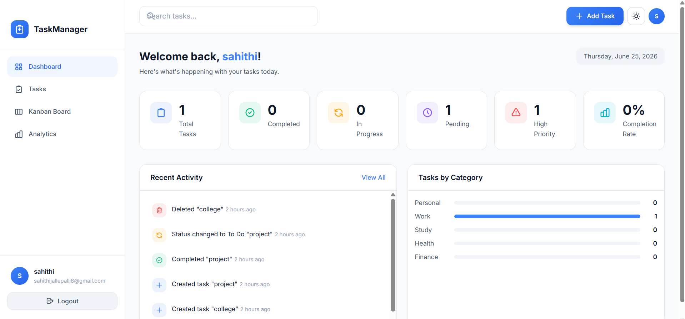
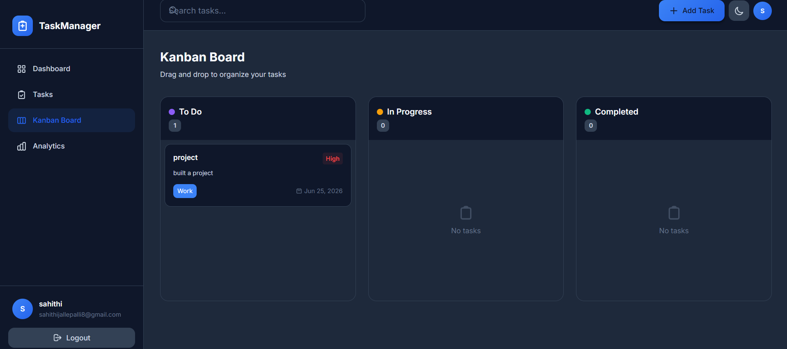
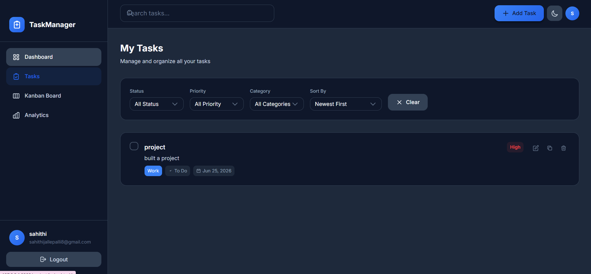

# TaskManager Pro

A modern and responsive task management web application built using **HTML5, CSS3, and Vanilla JavaScript**. The application helps users organize tasks efficiently through a dashboard, Kanban board, analytics, dark mode, and task management features.

## Developer

**Sahithi Jallepalli**

## Live Demo

Add your deployed GitHub Pages link here after deployment:

```text
https://sahithi-tech14.github.io/Task-manager-pro/
```

## Features

### Authentication

* User Registration
* User Login & Logout
* Session Management
* Form Validation

### Task Management

* Create Tasks
* Edit Tasks
* Delete Tasks
* Duplicate Tasks
* Update Task Status
* Task Details View

### Dashboard

* Total Tasks Count
* Completed Tasks Count
* Pending Tasks Count
* In Progress Tasks Count
* Completion Percentage

### Kanban Board

* Drag and Drop Tasks
* To Do Column
* In Progress Column
* Completed Column

### Search & Filters

* Search by Title
* Search by Description
* Filter by Priority
* Filter by Category
* Filter by Status

### Analytics

* Task Status Distribution
* Priority Distribution
* Completion Progress

### User Experience

* Dark Mode
* Toast Notifications
* Responsive Design
* Modern UI

## Technologies Used

* HTML5
* CSS3
* JavaScript (ES6+)
* LocalStorage
* Flexbox
* CSS Grid
* Drag & Drop API

## Project Structure

```text
TaskManager-Pro
│
├── index.html
│
├── css
│   ├── style.css
│   ├── auth.css
│   ├── dashboard.css
│   ├── kanban.css
│   └── responsive.css
│
├── js
│   ├── app.js
│   ├── auth.js
│   ├── storage.js
│   ├── tasks.js
│   ├── dashboard.js
│   ├── kanban.js
│   ├── analytics.js
│   ├── notifications.js
│   ├── theme.js
│   └── utils.js
│
└── README.md
```

## Installation

1. Clone the repository

```bash
git clone https://github.com/Sahithi-tech14/Task-manager-pro.git
```

2. Open the project folder.

3. Open `index.html` in your browser.

No additional installation or server setup is required.

## Screenshots

### Dashboard


### Kanban Board


### Dark Mode

(Add screenshot here)

## Skills Demonstrated

* Frontend Development
* Responsive Web Design
* JavaScript DOM Manipulation
* LocalStorage Data Persistence
* Authentication Logic
* CRUD Operations
* Event Handling
* Drag and Drop Functionality
* UI/UX Design
* Git & GitHub

## Future Improvements

* Backend Integration
* Database Support
* Cloud Storage
* Team Collaboration
* Task Sharing
* Email Notifications
* User Profile Management


## Author

**Sahithi Jallepalli**

GitHub: https://github.com/Sahithi-tech14

---

If you found this project useful, feel free to star the repository.
